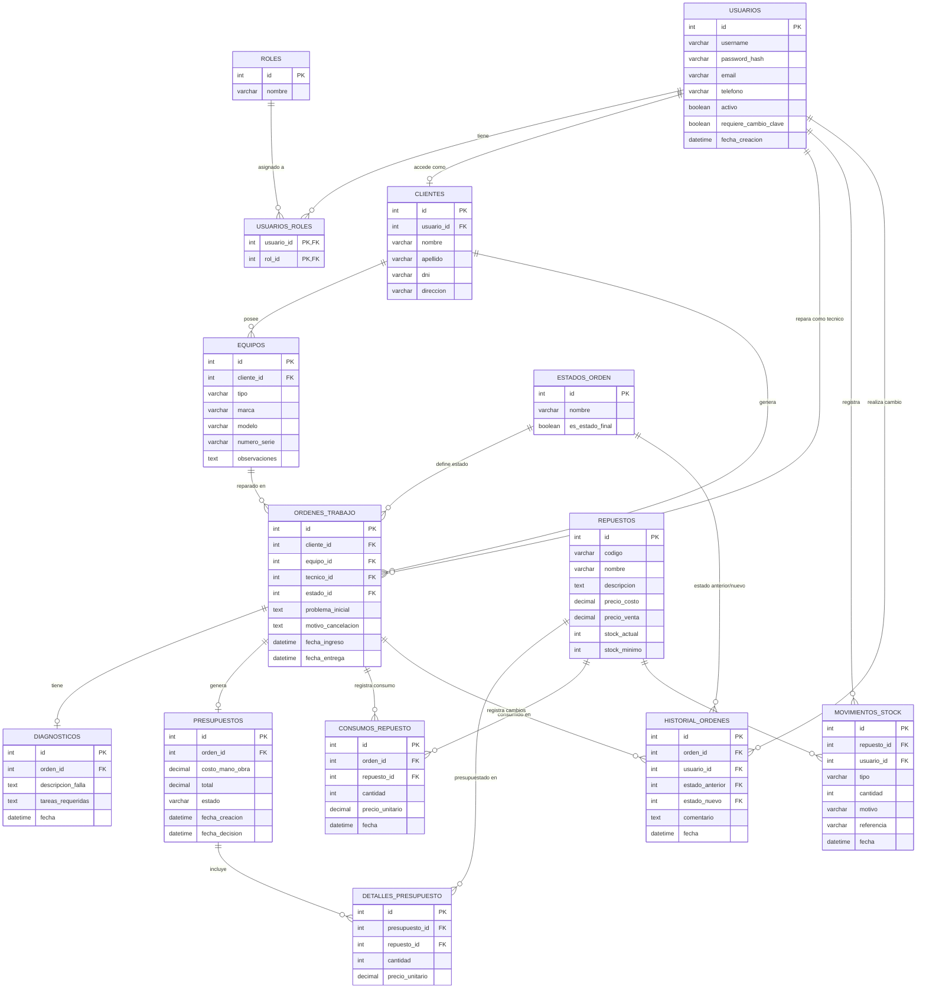

# FixHub — Diseño de la Base de Datos

Este documento presenta el diseño de la base de datos relacional de FixHub como parte de la Segunda Entrega del Trabajo Final Integrador.
El modelado se realizó a partir de los requerimientos funcionales, las reglas de negocio y los módulos definidos en la Primera Entrega.

## 1. Diagrama Entidad-Relación

A continuación se presenta el diagrama DER del sistema. Las relaciones indican la cardinalidad entre las entidades principales.

## 2. Diccionario de Datos

### 2.1. Módulo de Autenticación, Usuarios y Roles

#### Tabla `usuarios`
Representa las cuentas de acceso al sistema. Un usuario puede tener uno o varios roles.

| Campo | Tipo | Descripción |
|---|---|---|
| id | INT (PK) | Identificador único del usuario. |
| username | VARCHAR | Nombre de usuario único para inicio de sesión. |
| password_hash | VARCHAR | Contraseña almacenada de forma segura (hash). |
| email | VARCHAR | Correo electrónico, puede usarse como identificador de acceso. |
| telefono | VARCHAR | Número de celular, puede usarse como identificador de acceso. |
| activo | BOOLEAN | Indica si la cuenta está habilitada. |
| requiere_cambio_clave | BOOLEAN | Indica si debe cambiar la credencial temporal en el primer ingreso. |
| fecha_creacion | DATETIME | Fecha y hora de creación de la cuenta. |

#### Tabla `roles`
Catálogo de roles disponibles en el sistema.

| Campo | Tipo | Descripción |
|---|---|---|
| id | INT (PK) | Identificador único del rol. |
| nombre | VARCHAR | Nombre del rol (ADMINISTRADOR, RECEPCIONISTA, TECNICO, CLIENTE). |

#### Tabla `usuarios_roles`
Tabla intermedia que resuelve la relación muchos a muchos entre usuarios y roles.

| Campo | Tipo | Descripción |
|---|---|---|
| usuario_id | INT (PK, FK) | Referencia al usuario. |
| rol_id | INT (PK, FK) | Referencia al rol asignado. |

### 2.2. Módulo de Clientes y Equipos

#### Tabla `clientes`
Registro de las personas que llevan equipos al taller. Cada cliente tiene asociada una única cuenta de acceso.

| Campo | Tipo | Descripción |
|---|---|---|
| id | INT (PK) | Identificador único del cliente. |
| usuario_id | INT (FK, UNIQUE) | Cuenta de acceso vinculada al cliente. |
| nombre | VARCHAR | Nombre del cliente. |
| apellido | VARCHAR | Apellido del cliente. |
| dni | VARCHAR | Documento de identidad. |
| direccion | VARCHAR | Domicilio del cliente. |

#### Tabla `equipos`
Equipos que ingresan al taller, asociados a un cliente.

| Campo | Tipo | Descripción |
|---|---|---|
| id | INT (PK) | Identificador único del equipo. |
| cliente_id | INT (FK) | Cliente propietario del equipo. |
| tipo | VARCHAR | Tipo de equipo (celular, notebook, electrodoméstico, etc.). |
| marca | VARCHAR | Marca del equipo. |
| modelo | VARCHAR | Modelo del equipo. |
| numero_serie | VARCHAR | Número de serie o identificador único del equipo. |
| observaciones | TEXT | Observaciones adicionales sobre el equipo. |

### 2.3. Módulo de Órdenes de Trabajo

#### Tabla `estados_orden`
Catálogo de estados posibles de una orden de trabajo.

| Campo | Tipo | Descripción |
|---|---|---|
| id | INT (PK) | Identificador único del estado. |
| nombre | VARCHAR | Nombre del estado (RECIBIDA, EN_DIAGNOSTICO, PENDIENTE_APROBACION, etc.). |
| es_estado_final | BOOLEAN | Indica si es un estado final (ENTREGADA, CANCELADA). |

#### Tabla `ordenes_trabajo`
Entidad central del sistema. Representa cada reparación registrada.

| Campo | Tipo | Descripción |
|---|---|---|
| id | INT (PK) | Identificador único de la orden. |
| cliente_id | INT (FK) | Cliente asociado. |
| equipo_id | INT (FK) | Equipo sobre el que se realiza la reparación. |
| tecnico_id | INT (FK) | Técnico responsable. Puede ser nulo mientras la orden esté en RECIBIDA. |
| estado_id | INT (FK) | Estado actual de la orden. |
| problema_inicial | TEXT | Descripción del problema informado por el cliente al recibir el equipo. |
| motivo_cancelacion | TEXT | Motivo registrado en caso de cancelación. |
| fecha_ingreso | DATETIME | Fecha y hora de recepción del equipo. |
| fecha_entrega | DATETIME | Fecha y hora de entrega al cliente. |

#### Tabla `diagnosticos`
Registro del diagnóstico técnico de una orden. Cada orden tiene como máximo un diagnóstico.

| Campo | Tipo | Descripción |
|---|---|---|
| id | INT (PK) | Identificador único del diagnóstico. |
| orden_id | INT (FK, UNIQUE) | Orden asociada. |
| descripcion_falla | TEXT | Descripción de la falla detectada. |
| tareas_requeridas | TEXT | Tareas necesarias para la reparación. |
| fecha | DATETIME | Fecha del diagnóstico. |

#### Tabla `historial_ordenes`
Registro de los cambios relevantes en el ciclo de vida de una orden para mantener trazabilidad.

| Campo | Tipo | Descripción |
|---|---|---|
| id | INT (PK) | Identificador único del registro. |
| orden_id | INT (FK) | Orden afectada. |
| usuario_id | INT (FK) | Usuario que realizó el cambio. |
| estado_anterior | INT (FK) | Estado previo al cambio. |
| estado_nuevo | INT (FK) | Estado resultante. |
| comentario | TEXT | Comentario o motivo del cambio. |
| fecha | DATETIME | Fecha y hora del cambio. |

### 2.4. Módulo de Presupuestos y Aprobación

#### Tabla `presupuestos`
Presupuesto asociado a una orden. Cada orden que requiera presupuesto tendrá como máximo uno.

| Campo | Tipo | Descripción |
|---|---|---|
| id | INT (PK) | Identificador único del presupuesto. |
| orden_id | INT (FK, UNIQUE) | Orden asociada. |
| costo_mano_obra | DECIMAL | Costo de mano de obra. |
| total | DECIMAL | Total calculado (mano de obra + repuestos). |
| estado | VARCHAR | Estado del presupuesto (PENDIENTE, APROBADO, RECHAZADO). |
| fecha_creacion | DATETIME | Fecha de creación. |
| fecha_decision | DATETIME | Fecha en que el cliente aprueba o rechaza. |

#### Tabla `detalles_presupuesto`
Repuestos incluidos en un presupuesto. Representan una estimación y **no modifican el stock real**.

| Campo | Tipo | Descripción |
|---|---|---|
| id | INT (PK) | Identificador único del detalle. |
| presupuesto_id | INT (FK) | Presupuesto al que pertenece. |
| repuesto_id | INT (FK) | Repuesto presupuestado. |
| cantidad | INT | Cantidad estimada. |
| precio_unitario | DECIMAL | Precio unitario al momento del presupuesto. |

### 2.5. Módulo de Inventario y Stock

#### Tabla `repuestos`
Catálogo de repuestos. El stock se representa como un atributo de la entidad, sin una tabla independiente.

| Campo | Tipo | Descripción |
|---|---|---|
| id | INT (PK) | Identificador único del repuesto. |
| codigo | VARCHAR | Código interno del repuesto. |
| nombre | VARCHAR | Nombre del repuesto. |
| descripcion | TEXT | Descripción detallada. |
| precio_costo | DECIMAL | Precio de compra. |
| precio_venta | DECIMAL | Precio de venta sugerido. |
| stock_actual | INT | Cantidad disponible en el momento. |
| stock_minimo | INT | Stock mínimo para alertas. |

#### Tabla `consumos_repuesto`
Registro de los repuestos realmente consumidos durante una reparación. Se registra como concepto independiente del presupuesto.

| Campo | Tipo | Descripción |
|---|---|---|
| id | INT (PK) | Identificador único del consumo. |
| orden_id | INT (FK) | Orden en la que se consumió el repuesto. |
| repuesto_id | INT (FK) | Repuesto consumido. |
| cantidad | INT | Cantidad consumida. |
| precio_unitario | DECIMAL | Precio unitario al momento del consumo. |
| fecha | DATETIME | Fecha del consumo. |

#### Tabla `movimientos_stock`
Trazabilidad de todas las variaciones de stock (entradas, ajustes, consumos).

| Campo | Tipo | Descripción |
|---|---|---|
| id | INT (PK) | Identificador único del movimiento. |
| repuesto_id | INT (FK) | Repuesto afectado. |
| usuario_id | INT (FK) | Usuario que registró el movimiento. |
| tipo | VARCHAR | Tipo de movimiento (ENTRADA, AJUSTE, CONSUMO). |
| cantidad | INT | Cantidad del movimiento (positiva o negativa según el tipo). |
| motivo | VARCHAR | Motivo o descripción del movimiento. |
| referencia | VARCHAR | Referencia al documento relacionado (número de orden, etc.). |
| fecha | DATETIME | Fecha y hora del movimiento. |

## 3. Justificación del modelo de datos

El modelado de la base de datos de FixHub se realizó respetando las reglas de negocio definidas en la Primera Entrega y los módulos funcionales aprobados. A continuación se explican las decisiones de diseño más relevantes.

### 3.1. Elección de un modelo relacional (MySQL)

Se optó por una base de datos relacional porque el sistema requiere:

- **Integridad referencial fuerte**: las entidades están fuertemente relacionadas (cliente → equipo → orden → diagnóstico → presupuesto → consumos).
- **Transacciones ACID**: operaciones críticas como el consumo de repuestos y la actualización de stock deben ejecutarse de forma atómica para evitar inconsistencias.
- **Consultas complejas**: el dashboard y los reportes requieren agregaciones sobre múltiples tablas.
- **Trazabilidad**: el historial de órdenes y los movimientos de stock necesitan relaciones bien definidas.

Estas características hacen que un modelo relacional sea más adecuado que uno documental para el dominio del problema.

### 3.2. Relación entre usuarios, roles y clientes

- Se definió una **relación muchos a muchos** entre `usuarios` y `roles` mediante la tabla intermedia `usuarios_roles`, ya que una misma cuenta puede tener varios roles simultáneamente (por ejemplo, un propietario que es Administrador y Técnico a la vez) y sus permisos se acumulan.
- La relación entre `clientes` y `usuarios` es **uno a uno** (`usuario_id` con restricción `UNIQUE`), respetando la regla de negocio que indica que cada cliente tiene asociada una única cuenta de acceso y que esa cuenta no puede representar a más de un cliente.

### 3.3. Orden de trabajo como entidad central

La tabla `ordenes_trabajo` concentra las referencias a cliente, equipo, técnico y estado, ya que es el núcleo del proceso de reparación. Las entidades relacionadas (diagnóstico, presupuesto, consumos, historial) se modelaron como tablas separadas vinculadas por clave foránea, lo que permite:

- Mantener el diagnóstico como una entidad **uno a uno** con la orden (regla de negocio: cada orden tiene como máximo un diagnóstico).
- Manejar el presupuesto como una entidad **uno a uno opcional** (solo existe cuando la reparación lo requiere).
- Registrar múltiples consumos de repuestos y múltiples movimientos de historial por orden.

### 3.4. Estados como catálogo

Los estados de la orden se modelaron en una tabla `estados_orden` en lugar de usar un `ENUM` en la tabla de órdenes. Esto permite:

- Agregar o modificar estados sin alterar la estructura de la base de datos.
- Identificar fácilmente los estados finales mediante el campo `es_estado_final`.
- Referenciar estados anteriores y nuevos en el historial de forma consistente.

### 3.5. Stock como atributo de Repuesto

Siguiendo la regla de negocio explícita, el stock se representa como un atributo (`stock_actual`) de la entidad `Repuesto`, sin crear una tabla independiente `Stock`. Esto simplifica el modelo y es suficiente para el alcance del MVP, manteniendo la trazabilidad mediante la tabla `movimientos_stock`.

### 3.6. Separación entre presupuesto y consumo real

Se modelaron entidades independientes para:

- `detalles_presupuesto`: repuestos estimados en un presupuesto, que **no modifican el stock**.
- `consumos_repuesto`: repuestos realmente consumidos durante la reparación, que **sí modifican el stock**.

Esta separación respeta la regla de negocio que indica que "los repuestos presupuestados y los repuestos realmente consumidos se registrarán como conceptos diferentes", y permite comparar lo presupuestado versus lo efectivamente utilizado.

### 3.7. Trazabilidad mediante historial y movimientos

Se incorporaron dos tablas específicas para garantizar la trazabilidad:

- `historial_ordenes`: registra cada cambio de estado de una orden, incluyendo el usuario responsable, los estados anterior y nuevo, y un comentario.
- `movimientos_stock`: registra todas las variaciones de inventario (entradas, ajustes y consumos), permitiendo reconstruir el historial de un repuesto en cualquier momento.

Ambas tablas son clave para cumplir con las reglas de negocio de auditoría y control del sistema.

### 3.8. Coherencia con los módulos funcionales

El modelo respeta la organización en cinco módulos definida en la documentación de módulos:

- **Autenticación, usuarios y roles** → `usuarios`, `roles`, `usuarios_roles`.
- **Clientes y equipos** → `clientes`, `equipos`.
- **Órdenes de trabajo** → `ordenes_trabajo`, `estados_orden`, `diagnosticos`, `historial_ordenes`.
- **Presupuestos y aprobación** → `presupuestos`, `detalles_presupuesto`.
- **Inventario y stock** → `repuestos`, `consumos_repuesto`, `movimientos_stock`.

Cada módulo tiene sus tablas bien delimitadas y las relaciones entre ellos se mantienen mediante claves foráneas, sin duplicar responsabilidades.